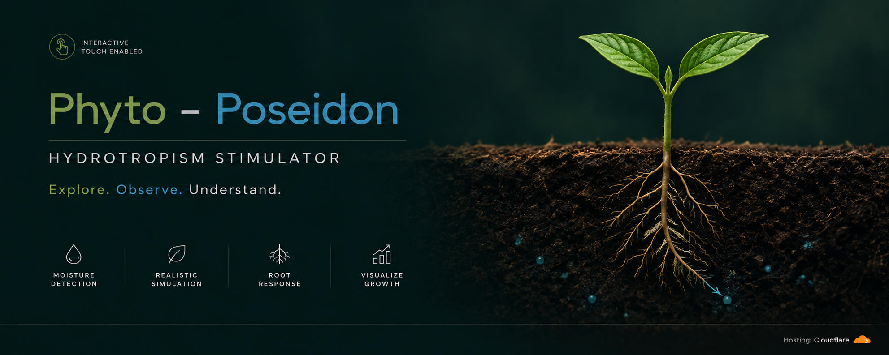

  

# 💧 Phyto-Poseidon

### *Interactive Hydrotropism Simulator*

> **Phyto-Poseidon** is an interactive visualization exploring **root hydrotropism, moisture gradients, directional root growth, and environmental responses**.
>
💧 **Plant Physiology** · 🌱 **Hydrotropism** · 🌊 **Water Gradient**

**🔬 [Explore the Simulation](https://phyto-poseidon.dray-ashcroft.workers.dev/)**

---

## ✦ Features

**💧 Moisture Gradient**  
Simulate moist and dry soil conditions to observe directional root growth toward water.

**⚙️ Interactive Controls**  
Adjust moisture levels and simulation parameters in real time.

**🌱 Growth Visualization**  
Observe progressive root curvature in response to moisture gradients.

**↻ Reset Functionality**  
Reset the simulation to explore different moisture conditions and growth responses.

---

## 🧬 Core Concepts

**Hydrotropism · Moisture Gradient · Root Growth · Directional Growth · Environmental Stimuli · Plant Physiology**

---

## ⚙️ Technology

**HTML · CSS · JavaScript**

**Repository:** GitHub & Codeberg  
**Hosting:** Cloudflare

---

## 📜 License

Distributed under the **GNU General Public License v3.0 (GPL-3.0)**.
